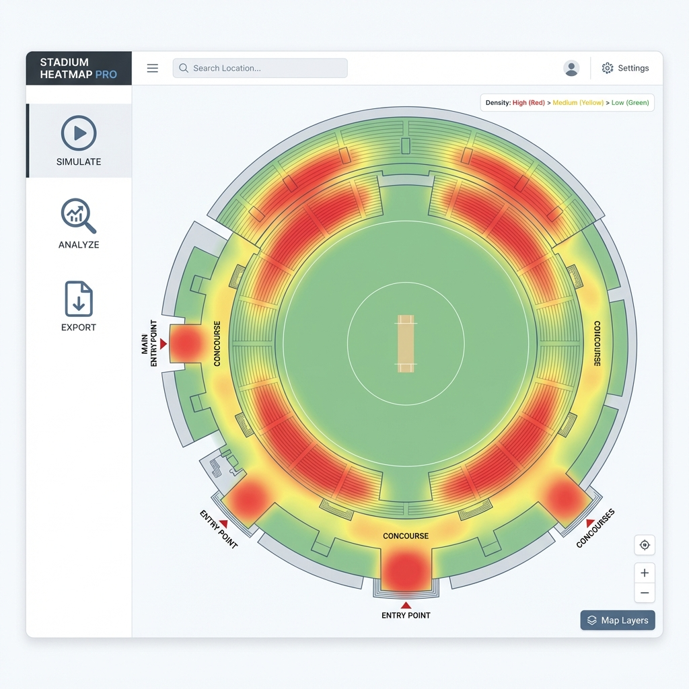
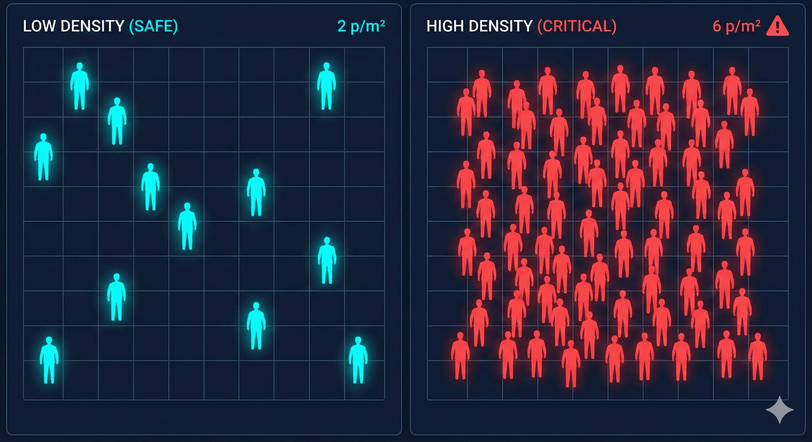
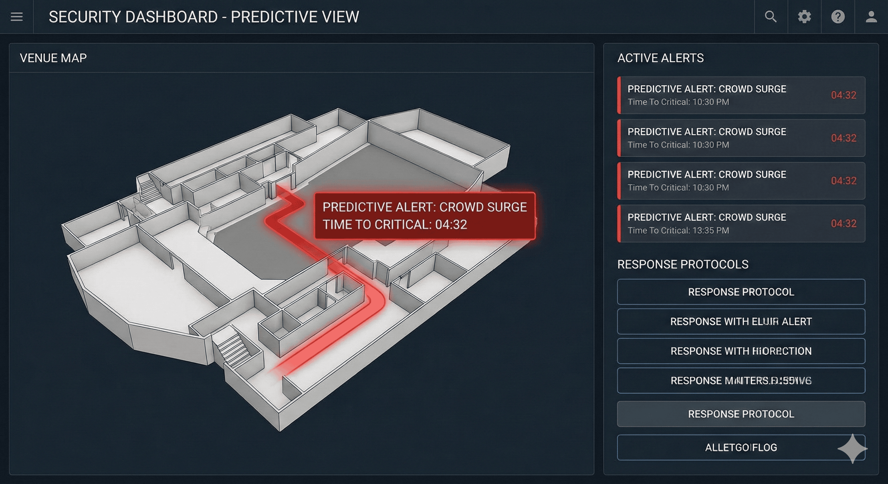
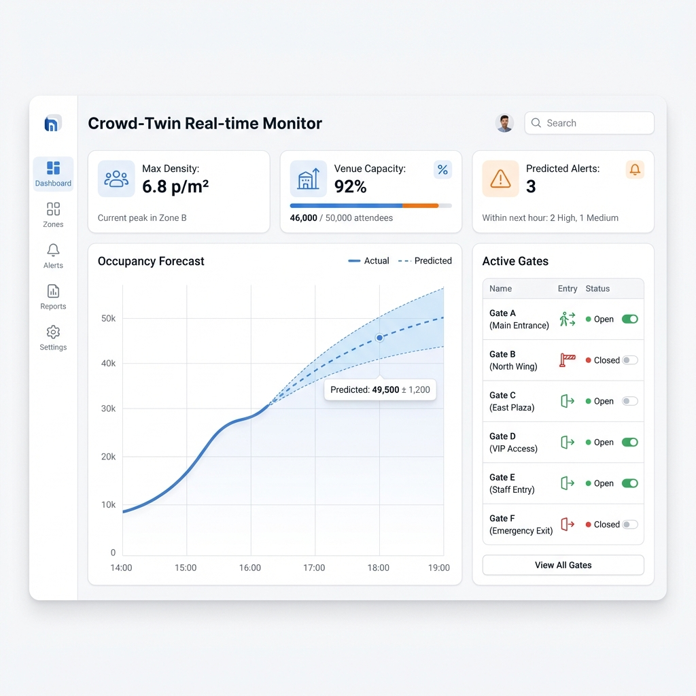

# Crowd-Twin: A Predictive Layer for Security Command Centers

**AJP Innovators**

We help **Security Firms** manage high-density crowds by predicting movement *before* it becomes critical.

---

# Security teams often react too late when a crowd becomes a fluid.

**The Problem:** At 7 p/m², people lose individual agency and the crowd behaves like a liquid. CCTV only alerts you *after* this threshold is hit.

**Example:** At a Stadium Exit, once a surge starts, guards are physically unable to push back. 

**Our Solution:** We provide a **15-minute lead time** to close gates or redirect flow *before* that surge even forms.

---

# Designed for Command Centers and Ground Task Forces.

We build tools for the people physically managing the venue.

*   **Command Center Operators:** Get a 15-minute forecast of future bottlenecks.
*   **Ground Task Forces:** Receive simple directives (e.g., "Divert Sector B to East Exit") via mobile.
*   **Technology:** Uses **Psychological ABM** to simulate how individual "virtual brains" react to stress—modeling people, not just water.

---

# We extend your existing monitoring into the future.

Existing tools help you design (Past) or watch (Present). We leverage that data to control what happens next.

| Tool | Focus | Limitation |
|:---|:---|:---|
| **Design (MassMotion)** | Architecture (Past) | Offline. No real-time use. |
| **Monitoring (CCTV)** | Surveillance (Present) | Alerts *after* density peaks. |
| **Crowd-Twin** | **Surveillance + Prediction (Future)** | **Forecasts 15 mins ahead using live feeds.** |

---

# What is Crowd-Twin?

**Crowd-Twin is a predictive analytics layer that integrates with existing CCTV infrastructure.**

We don't replace your cameras; we make them proactive. Our system uses a Psychological Agent-Based Model (ABM) to give security firms a "future-view" of their venue, allowing for precise, low-risk interventions.

---

# We are AJP Innovators, seeking partners to pilot this capability.

In India, event organizers are legally required to hire **PSARA-certified security firms**. We are seeking to pilot our predictive engine with these specialized teams.

*   **Founder Team:** Ayush Maurya, Jayanth Raju Saraswathi, Prabhav.
*   **Demo Website:** [Crowd-Twin](https://crowd-twin.vercel.app/)

---

# UI/UX Annexure: 10 Operational Screens

Our platform identifies three core use cases via a 10-screen functional suite:

1.  **Surveillance:** Live Heatmap, Predictive Mode, Simulated Playback.
2.  **Tactical Control:** Threshold Alerts, Command Panel, Staff Terminal, Outcome Forecast.
3.  **Risk Design:** Layout Stress-Test, Bottleneck Analysis, Safety Analytics.

---

# User Story 1: Critical Event Prevention
**Goal:** Intercept a 7.4 p/m² surge in Sector B before it becomes a physical lock.

*   **Flow:** Operators monitor the **Live Heatmap** ➔ **Predictive Mode** flags a surge ➔ **Threshold Alert** triggers ➔ Operator opens **Command Panel** ➔ **Execute Directive** ➔ Staff receives notice on **Staff Terminal**.
*   **Outcome:** Critical density avoided; lead-time verified via **Outcome Forecast**.

---

# User Story 2: Structural Risk Identification
**Goal:** Identify architectural failures under maximum capacity stress.

*   **Flow:** Designer uses **Stress-Test** to simulate 50k agents ➔ **Bottleneck Analysis** highlights "Exit 4 Stairwell" as a physical 200p/m limit.
*   **Insight:** Simulation identifies "Stairwell Hesitation" behavior that static models miss.

---

# User Story 3: Post-Match Governance
**Goal:** Audit the safety performance for regulatory compliance.

*   **Flow:** Safety Officer views **Safety Analytics** ➔ Verifies "Surges Prevented" KPI ➔ Checks **Sim Playback** for accuracy ➔ Exports the **Incident Audit Report**.
*   **Metric:** 92% successful prevention rate across 10 critical events.

